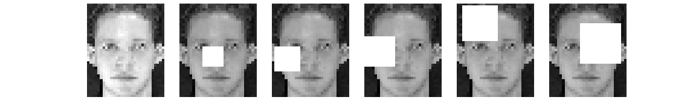
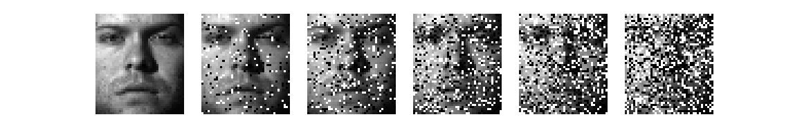
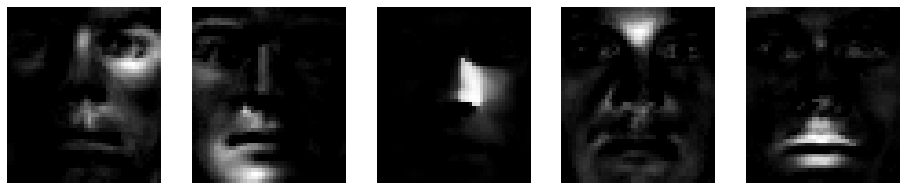
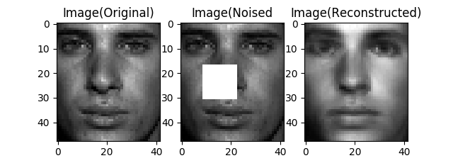
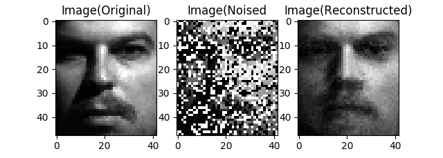
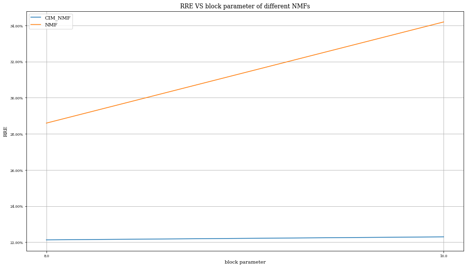

# Robust Non-Negative Matrix Factorization

## Background
This is a repository to reproduce robust NMF algorithms:

1. Standard NMF[1]

2. HCNMF[2]

3. L21 -NMF[3]

4. RCNMF[4]

5. RNMF-L1​[5]

6. L_1​-NMF[3]

7. HuberNMF[6]

8. CIM-NMF[6]

 __Note that the HCNMF in this repository is simplified. In details, it uses two global learning rates instead of element-wise learning rates the paper proposed for backtracking line search. Thanks to [AceKimi](https://github.com/JiaLiangShen) pointing it out and sharing his version. In the future, we will merge our versions if we have spare time.__

## Requirement

matplotlib-3.1.1  
numpy-1.27.2  
sklearn-0.21.3

## Usage

### Add noise

You can use `nmf.preprocess.add_block_noise` , `nmf.preprocess.add_salt_noise` to add two common types of image noise.

### Fit NMF

You can use classes in `nmf.nmfs` to fit NMF model and `nmf.evalute.inspect_dictionary` to inspect the dictionary it learned.

### Reconstruct images

You can use `nmf.evalute.reconstruct` to reconstruct images.

### Cross Validation Experiment 

It also provides function for CV experiments and plots the results.

An example can be found in the `./tutorial.ipynb`.

## References

\[1]: Lee, Daniel D., and H. Sebastian Seung. "Algorithms for non-negative matrix factorization." In *Advances in neural information processing systems*, pp. 556-562. 2001.  
\[2]: Hamza, A. Ben, and David J. Brady. "Reconstruction of reflectance spectra using robust nonnegative matrix factorization." IEEE Transactions on Signal Processing 54, no. 9 (2006): 3637-3642.  
\[3]: Lam, Edmund Y. "Non-negative matrix factorization for images with Laplacian noise." In APCCAS 2008-2008 IEEE Asia Pacific Conference on Circuits and Systems, pp. 798-801. IEEE, 2008.  
\[4]: Gao, Hongchang, Feiping Nie, Weidong Cai, and Heng Huang. "Robust capped norm nonnegative matrix factorization: Capped norm nmf." In Proceedings of the 24th ACM International on Conference on Information and Knowledge Management, pp. 871-880. ACM, 2015.  
\[5]: Zhang, Lijun, Zhengguang Chen, Miao Zheng, and Xiaofei He. "Robust non-negative matrix factorization." Frontiers of Electrical and Electronic Engineering in China 6, no. 2 (2011): 192-200.  
\[6]: Du, Liang, Xuan Li, and Yi-Dong Shen. "Robust nonnegative matrix factorization via half-quadratic minimization." In 2012 IEEE 12th International Conference on Data Mining, pp. 201-210. IEEE, 2012.

